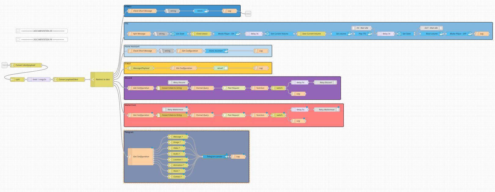

# node-red-flow-notification

Liens vers le flow : [ici](export.flow)

Hello,

Après avoir passer quelques heures sur mon système de notification multi-channel, je me dit que ça pourrais être cool partager mon subflow :wink:

Il est encore en cours de peaufinage, mais va déjà vous permettre de centralisé toutes vos notifications.

Actuellement, il gérée :

- HTML5 via Home Assistant
- Discord
- Mattermost
- Home Assistant (application mobile)
- Email
- Telegram
- TTS

Petit screen :



Je vous joins également la petite doc que j’ai intégrée dans le subflow :

----

**Information**

Ce subflow va vous permettre de notifier plusieurs service en même temps.

Actuellement il gérée les services :

- HTML5 (by Home Assistant)
- Discord
- Mattermost
- Telegram
- Email
- TTS
- Home Assistant (Mobile App)

**Pré-requis**

- node-red-contrib-string
- node-red-contrib-home-assistant-websocket
- node-red-node-email
- node-red-contrib-telegrambot

**Entrée**

Voici la liste des inputs actuellement possible :

```
msg.title = "Home Assistant - New version available"
msg.dest = "tel_clement;mail_clement;tts_80_hall"  
msg.message = "Home Assistant : New version available => 0.113.0 \nhttps://github.com/home-assistant/core/releases/tag/0.113.0"
msg.short_message = "Home Assistant : New version available (0.113.0)"
msg.image = "/data/image.jpeg"
msg.document = "/data/doc.js"
msg.video = "/data/video.mp4"
```

Tout les inputs ne sont pas forcement compatible avec les differents services.

**Titre** / *msg.title*

*Disponible sur : Email*

Titre du mail.

*Exemple:*
```
msg.title = "Home Assistant - New version available"
````


**Message** / *msg.message*

*Disponible sur : Email / Telegram / Discord*

Version longue du message.

*Exemple:*
```
msg.message = "Home Assistant : New version available => 0.113.0 \n https://github.com/home-assistant/core/releases/tag/0.113.0"
```
**Message court** / *msg.short_message*

*Disponible sur : HTML5 / Home Assistant*

Message reduit pour les services type « popup ».

*Exemple:*
```
msg.short_message = "Home Assistant : New version available (0.113.0)"
```

ATTENTION : Les messages est trim et les \n sont remplacer par des espace

=> Si il n’est pas défini, je reprend les msg.message

**Image** / *msg.image*

*Disponible sur : Telegram*

*Exemple:*
```
msg.image = "/data/image.jpeg"
msg.image = "https://cdn.pixabay.com/photo/2015/04/23/22/00/tree-736885__340.jpg"
```

**Document** / *msg.document*

*Disponible sur : Telegram*

*Exemple:*
```
msg.document = "/data/doc.js"
```

**Video** / *msg.video*

*Disponible sur : Telegram*

*Exemple:*
```
msg.video = "/data/video.mp4"
```

**Destinatation** / *msg.dest*

Un string qui contient la liste des services que vous désirez notifier séparer par des « ; »

*Exemple:*
```
msg.dest = "tel_clement;mail_clement;tts_80_hall"
```
  
Le message sera envoyé à :
- tel_clement
- mail_clement
- tts_80_hall

**HTML5**
La totalité des messages passe par ce système par défaut, pas besoin de l’ajouter en destination.

**Discord**

Dest doit commencer par discord_

*Exemple:*
```
msg.dest = "discord_communaute_news;discord_maison_information;discord_maison_network"
```  

**Home Assistant**

Dest doit commencer par tel_

*Exemple:*
```
msg.dest = "tel_clement;tel_papa;tel_maman
```

**Email**

dest doit commencer par mail_

*Exemple:*
```
msg.dest = "mail_clement;mail_thomas"
```

**Telegram**

dest doit commencer par telegram_

*Exemple:*
```
msg.dest = "telegram_smarthome;telegram_familly"
```

**TTS**

dest doit commencer par tts_

Format : tts_{VOLUME}_{ENTITY_ID_DU_MEDIA_PLAYER}

*Exemple:*
```
msg.dest = "tts_80_hall"
```

**Configuration**

Le subflow récupére sa configuration via la variable Global notif.

TTS n’a besoin d’aucune configuration particulière

*Exemple:*

```
// Discord channel ID
var discord = {
    "discord_communaute_news": XXXXXX,
    "discord_maison_general": XXXXXX,
    "discord_maison_alert": XXXXXX,
    "discord_maison_information": XXXXXX,
    "discord_maison_network": XXXXXX,
    "discord_maison_volets": XXXXXX,
}

// Entity ID of your phone
var home_assistant = {
    "tel_clement": "mobile_app_oneplus_a6010",
    "tel_nathalie": "mobile_app_oneplus_a5000"
}

// Email
var email = {
    "mail_1": "mail_1@xxxx.fr",
    "mail_2": "mail_2@xxxx.fr",
    "mail_3": "mail_3@xxxx.fr"
}

// Telegram channel_id
var telegram = {
    "telegram_smarthome": "-channel_id",
    "telegram_serie": "-channel_id",
    "telegram_film": "-channel_id"
}

global.set("notif.discord",discord);
global.set("notif.home_assistant",home_assistant);
global.set("notif.email",email);
global.set("notif.telegram",telegram);
```

Pour vous aidez dans la configuration voici une function qui va vous permettres de pousser votre configuration à chaque deploiement.

Tout ce passe dans le node Function.

```
[{"id":"eeef2d85.9fa7","type":"inject","z":"711f44dc.b8379c","name":"","props":[{"p":"payload"}],"repeat":"","crontab":"","once":true,"onceDelay":0.1,"topic":"","payload":"","payloadType":"date","x":190,"y":440,"wires":[["487a6ba5.82acf4","9492f68.6dd8208"]]},{"id":"9492f68.6dd8208","type":"function","z":"711f44dc.b8379c","name":"Config Exemple","func":"// Discord channel ID\nvar discord = {\n    \"discord_communaute_news\": XXXXXX,\n    \"discord_maison_general\": XXXXXX,\n    \"discord_maison_alert\": XXXXXX,\n    \"discord_maison_information\": XXXXXX,\n    \"discord_maison_network\": XXXXXX,\n    \"discord_maison_volets\": XXXXXX,\n}\n\n// Entity ID of your phone\nvar home_assistant = {\n    \"tel_clement\": \"mobile_app_oneplus_a6010\",\n    \"tel_nathalie\": \"mobile_app_oneplus_a5000\"\n}\n\n// Just email\nvar email = {\n    \"mail_1\": \"mail_1@xxxx.fr\",\n    \"mail_2\": \"mail_2@xxxx.fr\",\n    \"mail_3\": \"mail_3@xxxx.fr\"\n}\n\n// Just channel_id\nvar telegram = {\n    \"telegram_smarthome\": \"-channel_id\",\n    \"telegram_serie\": \"-channel_id\",\n    \"telegram_film\": \"-channel_id\"\n}\n\n// TTS\n// No configuration \n// Ex : tts_80_hall\n//   => Volume 80%\n//   => media_player.hall\n\nglobal.set(\"notif.discord\",discord);\nglobal.set(\"notif.home_assistant\",home_assistant);\nglobal.set(\"notif.email\",email);\nglobal.set(\"notif.telegram\",telegram);\n\nreturn msg;","outputs":1,"noerr":0,"initialize":"","finalize":"","x":380,"y":440,"wires":[[]]}]
```
Et voici un exemple de flow d’input :

```
[{"id":"66da3fb7.1e4ff","type":"change","z":"8a8a63c5.0c3c2","name":"","rules":[{"t":"set","p":"title","pt":"msg","to":"Coucou","tot":"str"},{"t":"set","p":"message","pt":"msg","to":"Long Message","tot":"str"},{"t":"set","p":"short_message","pt":"msg","to":"Short Message","tot":"str"},{"t":"set","p":"dest","pt":"msg","to":"tel_clement;mail_clement","tot":"str"}],"action":"","property":"","from":"","to":"","reg":false,"x":740,"y":1880,"wires":[["7300bcc2.c97c34"]]}]
```

#Enjoy